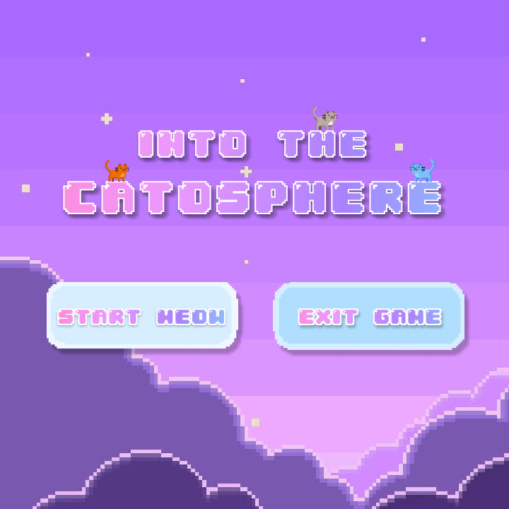
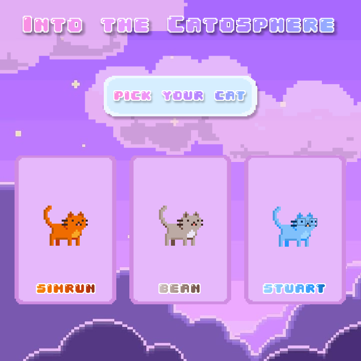

“Into the Catosphere” is a game where you follow a cat’s journey to space by helping the cat collect stars and navigate in the right direction. It is a platform game where you can interact with the gameboard and move in four directions.


## Unique Features

This game consists of a series of platforms and ladders with stars along the platforms. The objective of the game is to collect the stars and move up the ladders to reach the top of the screen. The cat starts out with 9 lives and 0 points. Each star collected increases your score by 10 points. Additionally, there are fireballs falling from the top of the screen. If you collide with a fireball you lose a life and so the player has to avoid the fireballs as they are moving up the screen. When you reach the top of the screen the board updates so that you can keep going. The game ends when you lose all your lives and your final score is displayed.

### Demo

<iframe width="560" height="315" src="https://www.youtube.com/embed/qA4CxLctgKY" frameborder="0" allow="accelerometer; autoplay; clipboard-write; encrypted-media; gyroscope; picture-in-picture" allowfullscreen></iframe>\

### Menu

Our game features several menu pages which includes a character selection menu where the player can choose which cat they would like to use as their avatar. Other menus are the game lobby where the user can choose to start playing or exit the game and the exit screen where the user can choose to replay the game.



### Gameboard
The platforms, ladders and gems are randomly generated every time the board is initialized or updated. This makes the game a novel experience every time you play it. Every board is checked to make sure there is at least one pathway to the top of the screen.

### Movement
The cat can move right and left when it is on a platform. On the ladders it can move up and down. There is gravity in the game so the cat falls off the edge of the platform and it can move left and right in the air as it is falling.

## Installation
Executing our game requires the installation of the Pygame library in Python. Install Python [here](https://www.python.org/downloads/) and Pygame [here](https://www.pygame.org/wiki/GettingStarted).
After downloading the files from the Catosphere repository, navigate to the catosphere folder and run the following code in your command line:
```bash
python main.py
```
More details can be found at the [Github repository](https://github.com/melodch/interactivegame).

## Creators

\
<a href="http://www.linkedin.com/in/serenachang1">Serena Chang</a>\
Babson College 2023\
Business Administration

\
<a href="http://www.linkedin.com/in/melody-chiu-6297b41a2">Melody Chiu</a>\
Olin College of Engineering 2023\
Engineering with Computing

\
<a href="https://www.linkedin.com/in/simrun-mutha-78b8761a0/">Simrun Mutha</a>\
Olin College of Engineering 2023\
Electrical and Computer Engineer

### Resources
Resources for this game include Erylith’s implementation of the Donkey Kong game made available on their <a href="https://github.com/erilyth/DonkeyKong-Pygame">Github</a>.
